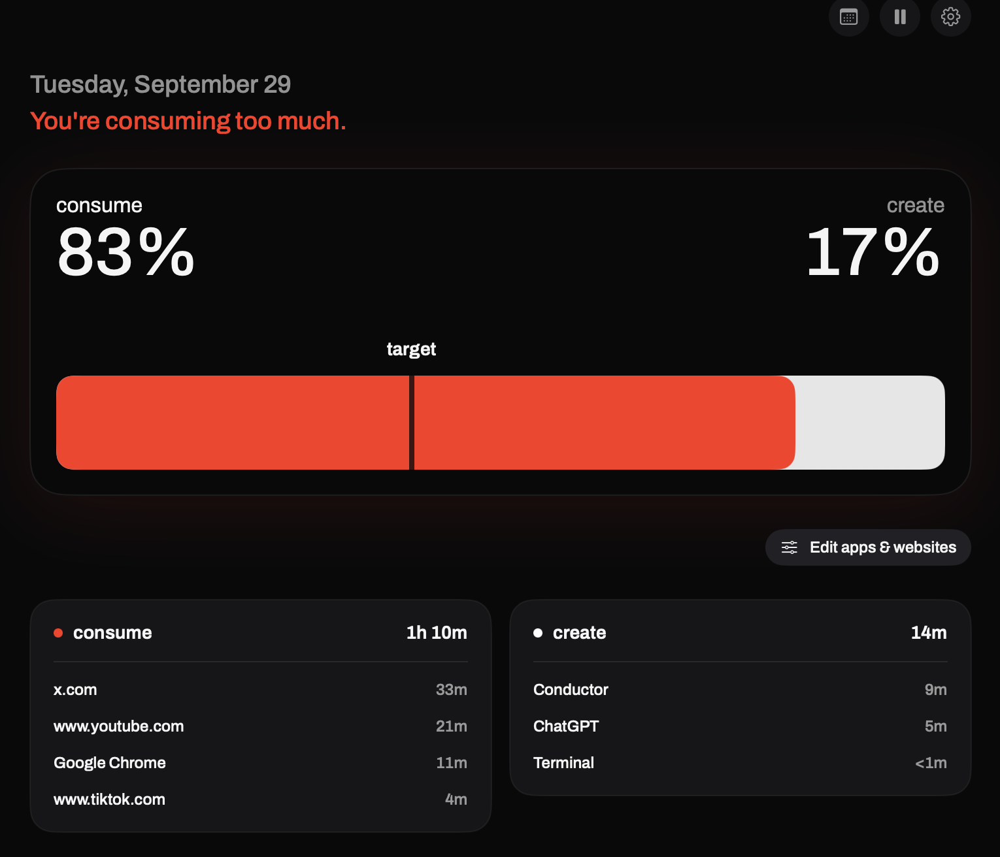
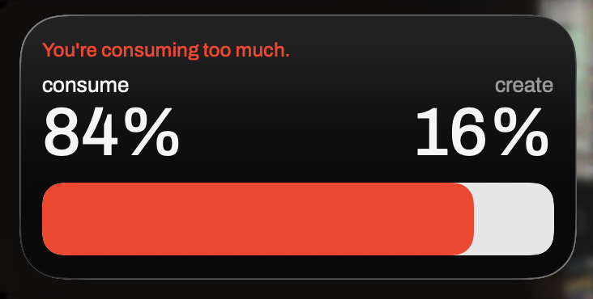

# consume:create

A native macOS 14+ menu bar app and WidgetKit desktop widget for balancing consumption and creation. The earlier HTML/CSS prototype is retained at the repository root; the shipping implementation is in `native/`.

## Screenshots

The dashboard shows the live consume/create ratio, the draggable daily target, and the apps and websites contributing to each side.



The desktop widget keeps the balance visible at a glance.



## Download

[Download consume:create for macOS](https://github.com/shridharathi/consume-create/releases/latest/download/consume-create-0.7.0-macos.zip), unzip it, and drag `consume-create.app` to Applications.

The download is signed with a Developer ID certificate and notarized by Apple. No Apple account, Team ID, Xcode, or terminal is required to install it.

## Install or build

consume:create is a native macOS 14+ app. The easiest way to run it from this repository is:

```sh
git clone https://github.com/shridharathi/consume-create.git
cd consume-create
make run TEAM_ID=YOUR_APPLE_TEAM_ID
```

You need Xcode and an Apple Developer team with **App Groups** enabled. Find the 10-character Team ID in **Xcode → Settings → Accounts**. The build uses your team automatically for the app and widget’s shared container; no source edits are required.

You can also open `native/ConsumeCreate.xcodeproj`, select your signing team for both targets, then run the **ConsumeCreate** scheme on **My Mac**.

For a release archive that can be uploaded to a GitHub Release:

```sh
make package TEAM_ID=YOUR_APPLE_TEAM_ID
# Creates dist/consume-create-<version>-macos.zip
```

For ongoing personal use, copy the built app into your Applications folder before enabling **Open at login**. Keep the app running; closing its window leaves the menu bar tracker active. Quitting stops tracking.

> A downloadable app for other people should be signed with a **Developer ID Application** certificate and notarized by Apple before being attached to a GitHub Release. The included package command builds a release zip; signing/notarization require the maintainer’s Apple Developer credentials and cannot be performed by a GitHub visitor.

## Add the desktop widget

1. Launch consume:create once and follow the welcome flow.
2. Right-click the desktop and choose **Edit Widgets**.
3. Search for **consume:create** and add the small square or medium horizontal widget.
4. Click the widget to open your day. **Edit apps & websites** opens two draggable columns, and the target line on the dashboard battery adjusts the daily goal.

## First-run setup

The welcome flow has three steps: welcome, sort apps/websites into consume and create, and drag the battery divider or choose a preset to set a goal. A final confirmation offers optional browser access and reminders. Cards have move arrows and keyboard-accessible menus as alternatives to dragging; the battery has accessibility increment/decrement actions.

Existing activity, classifications, notification settings, and goals survive upgrades through the shared App Group store.

The fill is consumption / (consumption + creation). The battery turns red strictly above the chosen limit. Unknown apps are ignored until classified. Reclassifying an app immediately updates today's totals.

## Tracking and permissions

- Tracks the foreground application locally, sampling every two seconds. Ignores consume:create itself. Stops while paused, asleep, screen-locked, or inactive for 60 seconds. Long sampling gaps aren't charged as usage.
- Safari and Google Chrome domain tracking is optional. Turn it on in Settings, activate a supported browser, and approve macOS Automation access. Active domains are sampled about every five seconds; app/tab transitions have that sampling granularity. If access fails, the app shows an explanation and falls back to the browser's app rule. An observed website gets its own rule, with parent-domain rules applying to subdomains; an unmatched website is ignored.
- Website tracking can observe domains in private browser windows too. Leave it off or pause tracking when you want those sessions excluded. Full URLs, titles, page contents, keystrokes, and screenshots are never saved.
- Notifications are opt-in. The first nudge requires five minutes of classified activity; further nudges require a new threshold crossing and a 30-minute cooldown. Notification permission is controlled by macOS.
- Automatic blocking is on by default and can be disabled in Preferences. When the ratio is over target, consume apps are hidden and consume tabs in connected Safari or Chrome sessions are replaced with a bundled local pause page. No browsing data is sent to a server.
- Startup at login uses Apple's ServiceManagement registration and is opt-in.
- Usage rolls over at local midnight. Compact daily summaries are retained locally for up to two years and appear in the in-app calendar; data from versions before calendar history was introduced cannot be reconstructed. Rules and settings persist. The app does not import Apple Screen Time history.
- The app writes an atomic JSON snapshot in its shared App Group container (`M325QUK9MT.com.counterbalance.shared/balance.json`). The extension only reads it. No backend or cloud workers are needed.

Desktop widgets are snapshots: macOS controls their refresh budget. The app requests periodic refreshes (15 minutes) and refreshes on threshold crossings or settings changes. The menu bar is the live view. See [Apple's widget refresh documentation](https://developer.apple.com/documentation/widgetkit/keeping-a-widget-up-to-date/).

## Verification

```sh
make test
codesign --verify --deep --strict native/build/Build/Products/Release/consume-create.app
pluginkit -m -A -D -i com.consumecreate.mac.widget
```

The model checks cover ratio/threshold math, automatic blocking state, calendar history, ignored time, pause, long idle/sleep gaps, domain-boundary matching, retroactive classification, midnight splitting, and persistence encoding.
